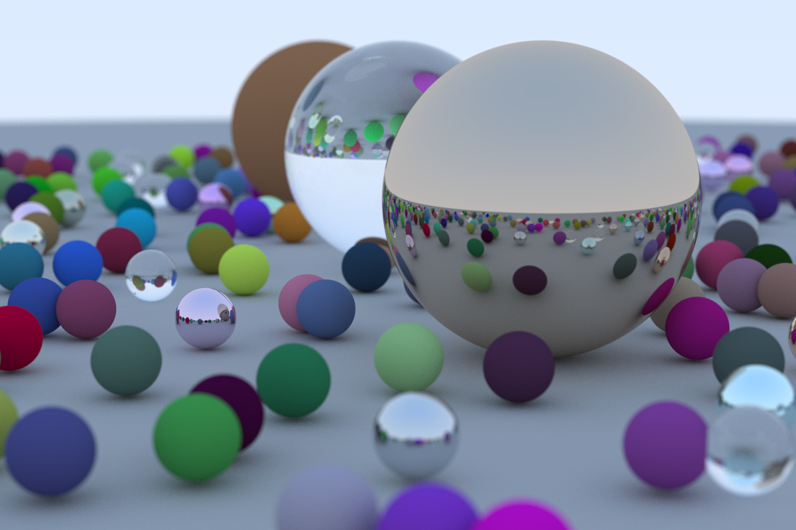

# Ray Tracer

A ray tracer built from scratch in Rust, following [Ray Tracing in One Weekend](https://raytracing.github.io/books/RayTracingInOneWeekend.html) with [The Ray Tracing Road to Rust](https://the-ray-tracing-road-to-rust.vercel.app/) as a companion guide for idiomatic Rust implementation.



---

## Features

- 3D vector math implemented from scratch (`Vec3`, `Point3`, `Ray`)
- Three physically modeled materials
  - Lambertian diffuse with random unit vector scattering
  - Metal with configurable fuzz factor
  - Dielectric glass with Schlick's approximation for reflectance
- Thin lens camera model with configurable aperture and focus distance for defocus blur
- Multi-sample antialiasing (500 samples per pixel)
- Recursive ray bouncing up to configurable depth (default 50)
- Trait-based scene graph via `Hittable` and `HittableList`
- Parallel rendering with [Rayon](https://github.com/rayon-rs/rayon) across all CPU cores

---

## Architecture

```
src/
├── main.rs          # Entry point, scene setup, render loop
├── vec3.rs          # Vec3 / Point3 types and math operations
├── ray.rs           # Ray struct
├── camera.rs        # Thin lens camera with defocus blur
├── hittable.rs      # Hittable trait and HitRecord
├── hittable_list.rs # Scene graph
├── sphere.rs        # Sphere primitive
├── material.rs      # Material trait, Lambertian, Metal, Dielectric
├── colors.rs        # Color output and gamma correction
└── common.rs        # Constants and utility functions
```

---

## Performance

The render loop uses Rayon to parallelize across pixels. Each pixel is independent, so the workload is embarrassingly parallel and all cores stay saturated.

| Configuration | Time |
|---|---|
| Single-threaded | ~90 minutes |
| Rayon parallel | ~30 minutes |

Specs: 1200x800 resolution, 500 samples per pixel, 50 max bounce depth.

---

## Usage

```bash
cargo build --release
cargo run --release > image.ppm
```

Output is written to stdout in PPM format. Convert to PNG with ImageMagick or any PPM viewer.

```bash
convert image.ppm image.png
```

---

## References

- [Ray Tracing in One Weekend](https://raytracing.github.io/books/RayTracingInOneWeekend.html) — Peter Shirley
- [The Ray Tracing Road to Rust](https://the-ray-tracing-road-to-rust.vercel.app/) — Rust-specific companion guide
- [Rayon](https://github.com/rayon-rs/rayon) — data parallelism library for Rust
